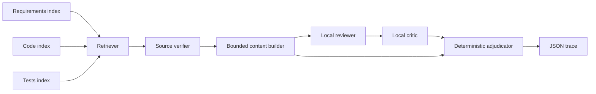

# Learning guide

This lab correlates three independent SQLite FTS5 indexes for each source
repository: requirements, implementation, and tests. A case selects evidence
from all three. The unified runner checks its provenance against the pinned
Git commit and the source files before giving short, numbered excerpts to the
local model. The model's replies remain observations; deterministic proofs
decide the final result for registered cases.



The reviewer and critic are sequential calls to the same local model. Their
separate prompts and handoff records demonstrate agent interaction, but they
are not independent models. `--mode offline` skips them and runs the same
retrieval, verification, packet, and adjudication stages.

This is lexical RAG: FTS5 retrieval supplies passages, verified excerpts
augment the prompt, and the local model generates reviewer/critic judgments.
`correlate` discovers candidates, while `run --mode local` uses citations
already selected in a case file; automatic selection for a new PRD line is not
implemented. The final verdict is deterministic rather than model-generated.

## Data and reproducibility

| Source | Used as | License | Pinned commit |
| --- | --- | --- | --- |
| [HTTPX](https://github.com/encode/httpx) | Python docs, code, tests | BSD-3-Clause | `b5addb64f0161ff6bfe94c124ef76f6a1fba5254` |
| [OpenSSF Scorecard](https://github.com/ossf/scorecard) | Go docs, code, tests | Apache-2.0 | `f92023a3f77879f96e0c9c1305f289d755be4bb6` |
| [Pluggy](https://github.com/pytest-dev/pluggy) | RST docs, Python code, tests | MIT | `54fb4ddda7d0e0dc9dde12fa5cebb9ae13d8cff9` |

The repository contains the lab's own code and case definitions. The source
clones and generated indexes are ignored by Git. Rebuild them from the pinned
source commits with `bash bootstrap.sh` from the project root. That command
also runs the lab tests and retrieval benchmark. The
[README's resource and security section](README.md#downloads-storage-and-hardware)
lists exactly what bootstrap downloads, measured disk and model memory use,
recommended headroom, and the local-service/privacy boundaries. To rebuild
each component manually instead, use:

```bash
git clone https://github.com/encode/httpx.git data/httpx
git -C data/httpx checkout b5addb64f0161ff6bfe94c124ef76f6a1fba5254
git clone https://github.com/ossf/scorecard.git data/scorecard
git -C data/scorecard checkout f92023a3f77879f96e0c9c1305f289d755be4bb6
git clone https://github.com/pytest-dev/pluggy.git data/pluggy
git -C data/pluggy checkout 54fb4ddda7d0e0dc9dde12fa5cebb9ae13d8cff9

python3 index_docs.py
python3 index_code.py
python3 index_tests.py
go build -o bin/go_chunks go_chunks.go
bin/go_chunks \
  data/scorecard/checks/evaluation/branch_protection.go \
  data/scorecard/checks/evaluation/branch_protection_test.go \
  data/scorecard/probes/blocksForcePushOnBranches/impl.go \
  data/scorecard/probes/blocksForcePushOnBranches/impl_test.go \
  > indexes/scorecard_samples.jsonl
python3 index_scorecard_docs.py
python3 index_scorecard_go.py
python3 index_pluggy.py
```

Use `ollama pull qwen2.5:1.5b` and start Ollama locally for model runs. The
policy permits only `http://127.0.0.1:11434/api/chat`; the lab does not use a
paid API. The offline workflow works without Ollama.

## Run the cases

```bash
python3 lab.py run --case cases/default_timeout.json --mode offline
python3 lab.py run --case cases/default_timeout_ten.json --mode offline
python3 lab.py run --case cases/scorecard_branch_protection.json --mode offline
python3 lab.py run --case cases/pluggy_firstresult.json --mode offline
python3 lab.py run --case cases/pluggy_firstresult_list.json --mode offline
python3 lab.py run --case cases/pluggy_firstresult_related_test.json --mode offline
python3 lab.py run --case cases/pluggy_firstresult.json --mode local
python3 lab.py run --case cases/scorecard_branch_protection.json --mode local
```

The expected final results are:

| Case | Implementation | Direct cited test |
| --- | --- | --- |
| HTTPX five-second default | `supports` | `not_established` |
| HTTPX ten-second default | `contradicts` | `not_established` |
| Scorecard Branch-Protection Tier 1 | `supports` | `established` |
| Pluggy first non-`None` scalar result | `supports` | `established` |
| Pluggy claim that `firstresult` returns a list | `contradicts` | `not_established` |
| Pluggy scalar claim with only a related `None` test | `supports` | `not_established` |

`not_established` means the **cited tests** do not establish that exact claim;
it does not assert that no suitable test exists elsewhere. `expected` in a case
file is used only after adjudication to grade the result. It is never sent to
the model or used to choose the final verdict.

In local-model runs, Qwen2.5 1.5B incorrectly supported the false Pluggy list
claim and incorrectly called both adversarial test sets direct. The final
guardrail returned the expected results and recorded three and two model
disagreements, respectively.

Every run writes a JSON trace under `runs/` with the source commit, citations,
packet hash and size, agent handoffs, model opinions, disagreements, final
proof, and evaluation. The trace can be audited against the pinned source.

## Retrieval and context engineering

Start with one line item and choose 2–5 distinctive terms. For example,
“Prevent force push on protected branches” becomes `force push`. Search the
repository whose implementation you want to inspect:

```bash
python3 lab.py correlate --repo scorecard --query 'force push' --limit 10
```

Inspect `candidates.requirement`, `candidates.code`, and `candidates.test`,
then open the cited source lines. This example surfaces Scorecard's force-push
docs, probe, and tests. `links` are shared-word suggestions, not proof that the
whole line item is implemented. The [HTML walkthrough](LEARNING_WALKTHROUGH.html)
has a local query builder for this task.

If the line item comes from your own, unindexed PRD, its words can drive this
search, but the PRD itself is **not** cited or checked. Requirement candidates
come from the selected repository's indexed docs. A verified verdict for your
own line item requires indexing it as a pinned requirement source, reviewing
its code/test citations, and registering a claim-specific proof. The current
CLI does not do those steps automatically.

You can also search each database independently, then compare citations:

```bash
python3 lab.py discover --repo scorecard --kind requirement --query force
python3 lab.py discover --repo scorecard --kind code --query force
python3 lab.py discover --repo scorecard --kind test --query force
python3 lab.py correlate --repo scorecard --query 'force push'
python3 lab.py correlate --repo httpx --query 'default timeout'
python3 lab.py correlate --repo pluggy --query firstresult
```

FTS5 scores rank lexical matches; they do not prove relevance. `correlate`
merges candidates from all three databases, suggests links on shared query
terms, and follows prominent code symbols into a second set of references.
This second hop finds HTTPX client constructors through
`DEFAULT_TIMEOUT_CONFIG`, which a plain timeout query ranks poorly. These are
candidate links, not semantic proof. For Python code, a small second-stage
signal promotes functions where a searched name controls a branch containing
`break` or `return`. This moves Pluggy's `_multicall` from rank 11 to rank 1
for `firstresult` in both `discover` and `correlate`; the signal only changes
candidate order and does not prove the claim. Camel-case Go symbols may still
require searching the exact symbol or inspecting source manually. Case files
preserve reviewed citations and small
`focus` ranges. `lab_core.py` rejects a stale index, a source mismatch, a path
outside the source checkout, or a focus outside the indexed symbol. It then
builds a line-numbered packet from the source file. The policy caps it at
5,000 characters; overflow fails closed rather than silently omitting cited
evidence.

Measure five pinned, hand-reviewed targets with:

```bash
python3 benchmark_retrieval.py
```

On this fixture, recall at five improved from 3/5 to 4/5, and mean reciprocal
rank at 20 from 0.643 to 0.825. The remaining miss is Pluggy's direct scalar
test at rank 8. The benchmark is small and checks discovery ranking, not
semantic correctness; inspect the per-target ranks before changing the
retriever.

To experiment with a smaller budget:

```bash
python3 lab.py run --case cases/scorecard_branch_protection.json --budget 2000
```

That command should reject the 4,278-character Scorecard packet.

## Policy, RBAC, and guardrails

`policy.json` pins repositories, commits, index names, role permissions,
allowed agent handoffs, context cap, and the local model endpoint. Try:

```bash
python3 lab.py roles
python3 lab.py discover --repo scorecard --kind requirement --query force --principal observer
python3 lab.py discover --repo scorecard --kind code --query force --principal observer
python3 lab.py run --case cases/default_timeout.json --principal auditor --mode offline
python3 lab.py run --case cases/default_timeout.json --principal auditor --mode local
```

The observer can search requirements but not code. The auditor can run the
deterministic workflow but cannot call the model. The default `learner`
principal can do both. These checks teach RBAC inside an application; a person
who can edit `policy.json` or choose another `--principal` is not isolated by
the operating system.

The provenance and context checks apply to every case. `lab_guards.py` contains
claim-specific proofs: Python AST checks for HTTPX's constant and constructor
defaults, explicit cited Scorecard branches plus the table case and runner,
and a Pluggy AST check for skipping `None`, stopping, and returning a scalar.
Unknown case IDs return `insufficient` and `undetermined`. An LLM cannot
promote an unregistered claim to `supports` or `established`. Source text is
treated as untrusted prompt data, not as instructions.

## Extend the lab

1. Add a case JSON under `cases/` with a claim, pinned commit, requirement,
   implementation, and test citations. Keep `focus` ranges short and include
   the test runner when the expected result comes from a table-driven test.
2. Use `lab.py discover` and source inspection to find evidence across the
   separate databases. Reindex if the source changes.
3. Run offline. An unfamiliar case should return `insufficient` and
   `undetermined`; register a narrow proof in `lab_guards.py` only after you
   can state its exact evidence conditions.
4. Add a regression test for a missing or altered condition, then try the
   local model and compare its opinions with the deterministic result.

Run `python3 -m unittest discover -s tests -v` after changes. The project is
still a learning lab: there is no general semantic proof for arbitrary PRDs,
no operating-system RBAC isolation, no browser UI, and no independent model
ensemble.

The Pluggy case cites upstream test source. The regression suite also executes
a small test against the pinned Pluggy package without pytest. It does not run
Pluggy's full upstream pytest suite.
